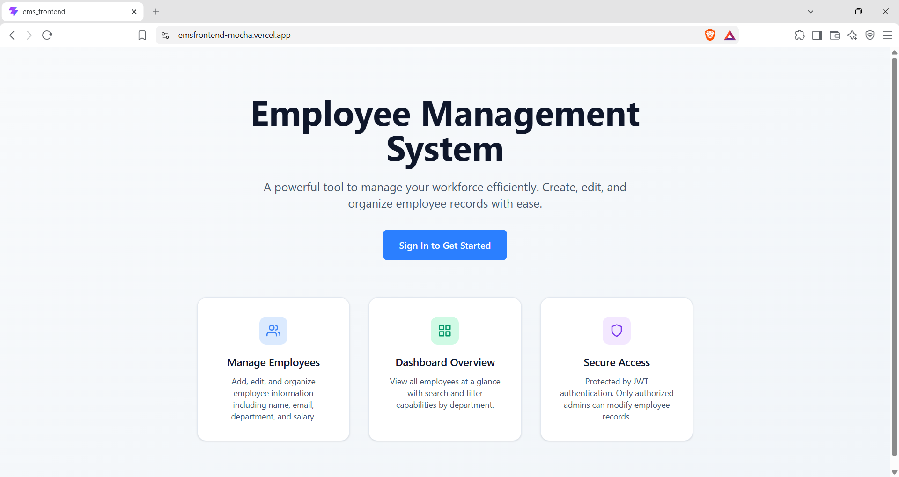
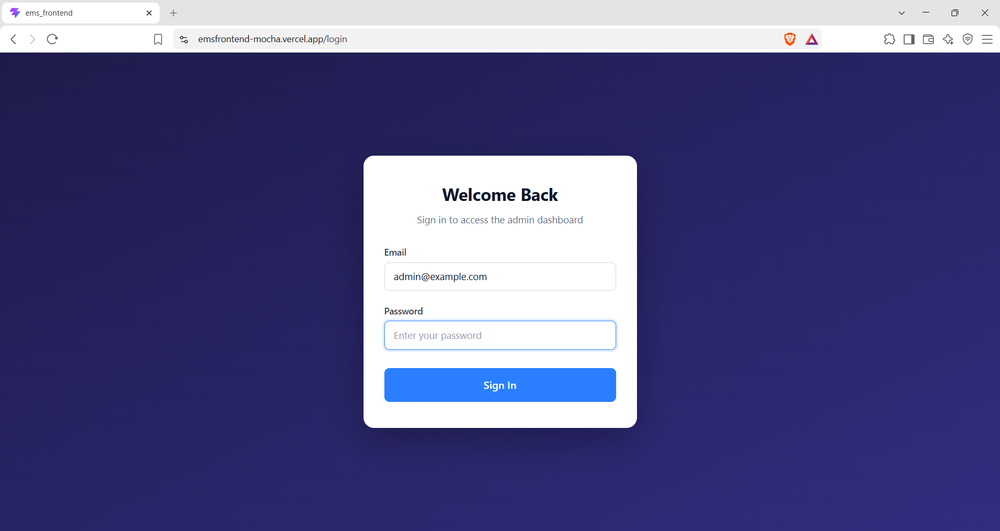
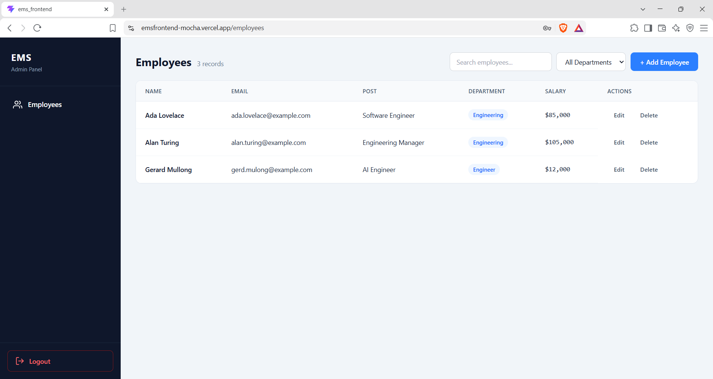
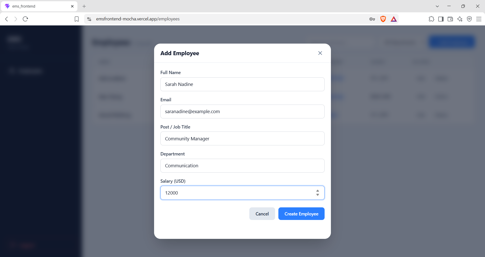
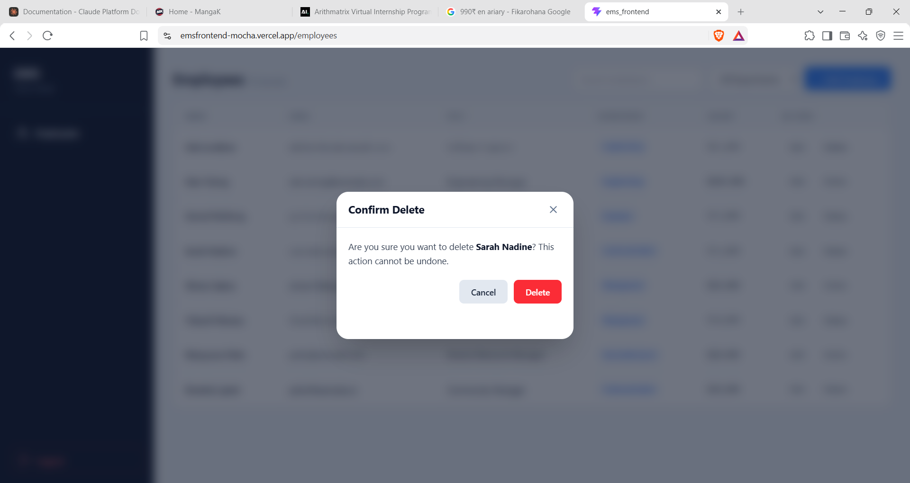
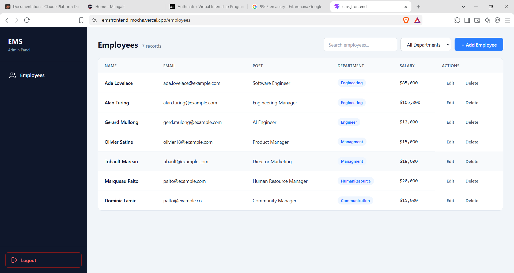

# Employee Management System — Demo & Workflow

This document walks through the full user journey of the Employee Management System (EMS), from the public landing page through login, and then the authenticated admin workflow for managing employee records.

---

## 1. Landing Page

When a user first opens the application, they land on a clean, public home page. No authentication is required to view it. The page explains what the system does and offers a single call-to-action.

**If the user is already logged in**, the button reads **"Go to Dashboard"** and points to `/employees`.  
**If the user is not logged in**, the button reads **"Sign In to Get Started"** and points to `/login`.



The landing page communicates three core capabilities through feature cards:
- **Manage Employees** — add, edit, and organize employee records.
- **Dashboard Overview** — view, search, and filter employees by department.
- **Secure Access** — JWT-based authentication protects all write operations.

---

## 2. Authentication

Clicking the CTA button when not authenticated navigates to the login page. The layout is a centered card on a dark gradient background, optimized for both desktop and mobile.

The user must enter the seeded admin credentials:
- **Email:** `admin@example.com`
- **Password:** `change-me-now`

The frontend sends a `POST /api/auth/login` request. On success, the backend returns a JWT token, which the frontend stores in `localStorage` and in a Zustand persist store. The user is then redirected to the employee dashboard.



If credentials are invalid, an error banner is displayed inline.


---

## 3. Employee Dashboard

After successful authentication, the user enters the admin area. The layout consists of a dark sidebar (collapsible to an icon-only rail on mobile) and a main content area. The sidebar contains a single navigation item, **Employees**, pointing to `/employees`. A **Logout** button clears the auth state and redirects to `/login`.

### 3.1 Listing Employees

The dashboard loads the employee list automatically on mount via `GET /api/employees`. The response from the backend is wrapped in `{ employees, status }`; the frontend unwraps it before rendering.

- **Desktop** — employees are displayed in a full-width table with columns for Name, Email, Post, Department, Salary, and Actions.
- **Mobile (< 700px)** — the table hides and a card view is shown instead. Each card displays the employee's name, email, department badge, post, formatted salary, and action buttons.



### 3.2 Searching and Filtering

A search input filters employees by name, email, or post in real time (client-side). A department dropdown filters by the unique departments present in the current list. Both filters are combined with AND logic.

### 3.3 Creating an Employee

Clicking **+ Add Employee** opens a modal dialog with a validated form. Fields:

| Field | Validation |
|-------|-----------|
| Full Name | Required |
| Email | Required, must be valid email format |
| Post / Job Title | Required |
| Department | Required |
| Salary (USD) | Required, non-negative number |

On submit, the frontend sends `POST /api/employees` with the `Authorization: Bearer <token>` header. On success, the new employee is appended to the local list and the modal closes.

  


### 3.4 Editing an Employee

Clicking **Edit** on any row opens the same modal, pre-filled with that employee's data. The same validation applies. On submit, the frontend sends `PATCH /api/employees/:id`. On success, the matching record in the local list is replaced with the updated version.


### 3.5 Deleting an Employee

Clicking **Delete** opens a confirmation modal. On confirmation, the frontend sends `DELETE /api/employees/:id` and removes the record from the local list immediately.

  


---

## 4. Full Workflow Diagram

```
[Landing Page] (/)
       |
       | CTA button
       v
[Login Page] (/login)
       |
       | POST /api/auth/login { email, password }
       | → { token }
       v
[Employee Dashboard] (/employees)
       |
       | GET /api/employees
       | → { employees: [...] }
       v
[Table / Card List]  ← responsive at 700px
       |
       |--- [Add Employee] → Modal → POST /api/employees → append to list
       |--- [Edit]         → Modal → PATCH /api/employees/:id → update in list
       |--- [Delete]       → Modal → DELETE /api/employees/:id → remove from list
       |--- [Search]       → client-side filter
       |--- [Dept Filter]  → client-side filter
       v
[Logout] → clear localStorage + Zustand → redirect to /login
```

---

## 5. Technical Notes

### Responsive Breakpoints

| Screen Size | Behavior |
|-------------|----------|
| `>= 700px` | Employee table visible, card view hidden |
| `< 700px` | Employee table hidden, card view visible |
| `>= 768px` | Sidebar full width (260px) with text labels |
| `< 768px` | Sidebar collapses to icon-only rail (70px) |
| `<= 640px` | Modals become bottom-sheet style |

### State Management

- **Auth state**: `localStorage` + Zustand `persist` middleware (`ems_auth`). Survives page refresh.
- **Employee list state**: local React state inside `useEmployees` hook. CRUD operations update this state immediately for a responsive UI.
- **401 handling**: Axios response interceptor catches `401 Unauthorized`, clears auth state, and redirects to `/login`.

### API Response Shape

All employee endpoints return objects, not raw arrays:

```json
// GET /api/employees
{ "employees": [...], "status": 200 }

// GET /api/employees/:id
{ "employee": {...}, "status": 200 }

// POST /api/employees
{ "employee": {...}, "status": 200 }

// PATCH /api/employees/:id
{ "employee": {...}, "status": 200 }

// DELETE /api/employees/:id
204 No Content
```

The login endpoint returns a plain token:

```json
// POST /api/auth/login
{ "token": "eyJhbGciOiJI..." }
```

### Running the Demo

1. Start the backend:
   ```bash
   cd ems_backend
   yarn install
   yarn dev
   ```
2. Start the frontend:
   ```bash
   cd ems_frontend
   npm install
   npm run dev
   ```
3. Open `http://localhost:5173`.
4. Log in with `admin@example.com` / `change-me-now`.
